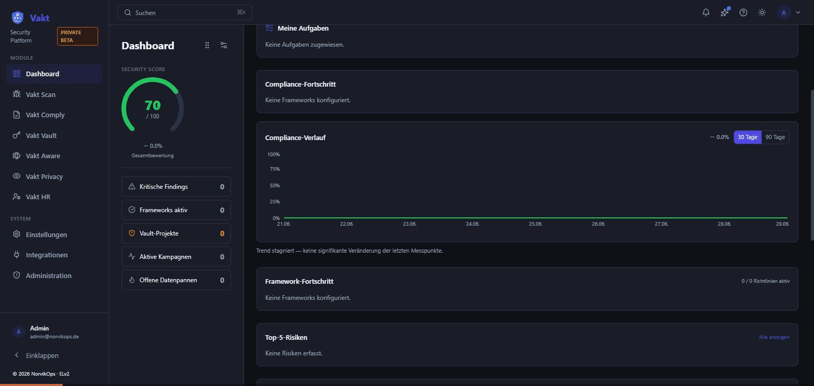
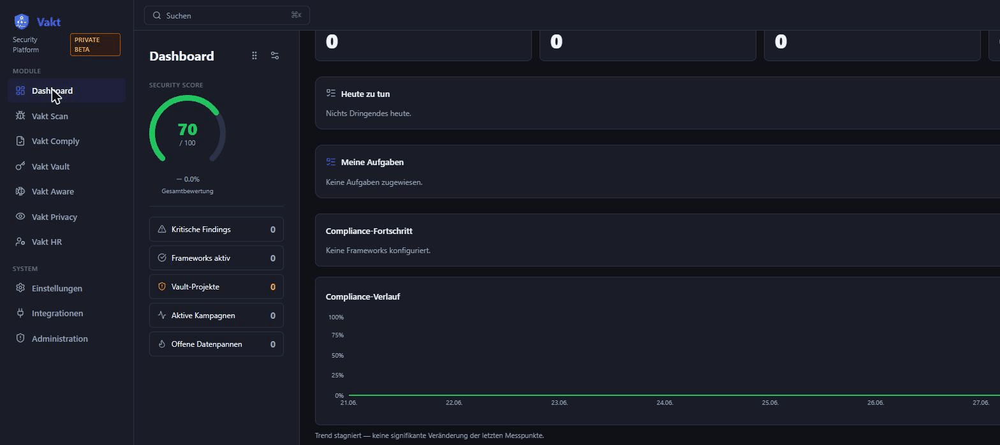
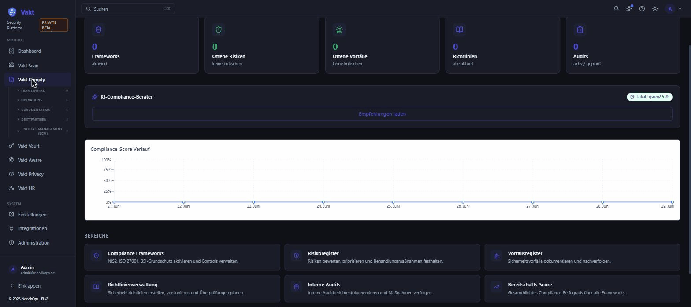
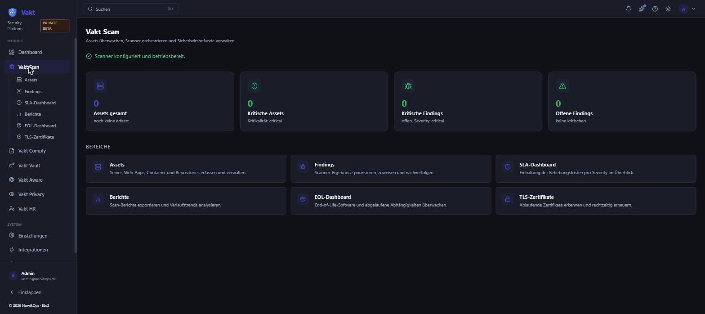
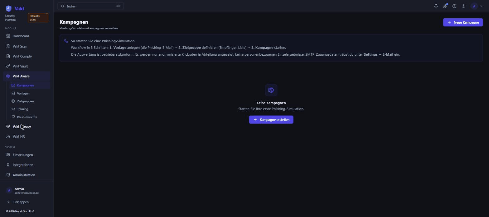
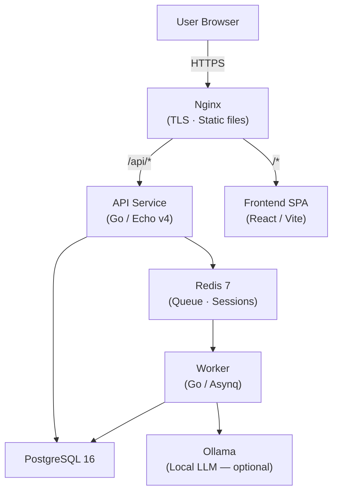

# Vakt

**Self-hosted Security & Compliance Platform — NIS2, ISO 27001, BSI-Grundschutz, EU AI Act. Deploy in 5 minutes. Local AI — your data never leaves your server.**


> **Early Access** — Vakt is under active development. Expect rough edges and breaking changes between releases. Support is **best-effort (no SLA)**, and as a self-hosted product **backups/restore are your responsibility** (scripts + runbook included). See the [Early Access Disclaimer](docs/wiki/beta-disclaimer.md) for details. Feedback welcome: [hello@norvikops.de](mailto:hello@norvikops.de)

**Try it locally** — `docker compose up -d` and open [http://localhost](http://localhost). No sign-up, no cloud, no data leaving your machine.



---

## What is Vakt?

Vakt is a **self-hosted, source-available** compliance documentation platform for SMEs in the DACH region. It helps IT security officers implement and document NIS2, ISO 27001, BSI IT-Grundschutz, GDPR (Art. 32 TOM), and more — **without sending any data outside your own infrastructure**.

**Why self-hosted?** Compliance data (vulnerability findings, risk registers, audit evidence) is among the most sensitive data your organisation holds. Sending it to a US cloud compliance platform creates regulatory exposure (SCHREMS II, GDPR Art. 44+) and strategic risk. Vakt keeps all data local — including the AI advisor, which runs via Ollama on your own server.

**Why source-available?** Business continuity. An ISMS platform is critical infrastructure. With ELv2, the full source code is auditable and you can keep running Vakt independently if we ever disappear — no data held hostage, no vendor lock-in.

Free-to-self-host alternative to Vanta, Drata, or DataGuard (~€9,000–25,000/year). Deploy with a single `docker compose up` — **ready in under 5 minutes**. The bundled local AI advisor takes a bit longer on first start (downloads the ~4.5 GB `qwen2.5:7b` model on first launch — 3–30 minutes depending on bandwidth). The platform itself is ready immediately.

---

## Modules

| Module | Description |
|---|---|
| 📊 **Vakt Comply** | Compliance hub: control tracking, gap analysis, risk register, incident register, policy templates (10 German templates), auditor portal, audit package export (ZIP), AI-generated reports, NIS2 registration wizard, Trust Center |
| 🔍 **Vakt Scan** | Scanner orchestration: Trivy, Nuclei, OpenVAS. Finding deduplication, SLA tracking, daily BSI CERT-Bund advisory feed, automatic evidence on resolved findings |
| 🔐 **Vakt Vault** | Secrets management: AES-256-GCM storage, Git repo scanning (gitleaks), automatic rotation, CI/CD integration |
| 📧 **Vakt Aware** | Security awareness: internal phishing simulations, micro-trainings, SMTP campaigns, anonymised reporting (Betriebsrats-konform), automatic evidence on training completion |
| 📋 **Vakt Privacy** | GDPR documentation hub: VVT (Art. 30), DPIA (Art. 35), AVV management (Art. 28), DSR workflows, breach notification records (Art. 33/34) |
| 👥 **Vakt HR** | Employee lifecycle management: onboarding and offboarding checklists, checklist runs per employee, employee directory with status tracking. Audit-ready evidence that access provisioning and revocation steps were completed. |

**Shared features across all modules:**

- Webhook alerting — Slack, Teams, generic webhooks with HMAC signing
- In-app notifications and weekly email digest
- Prometheus metrics endpoint
- Global search across all modules
- Data retention policies
- 2FA / TOTP
- Session management
- BSI CERT-Bund advisory feed
- Cross-module evidence automation (e.g. resolved findings and completed trainings flow into Vakt Comply)
- Admin CLI
- Public Trust Pages

---

## Screenshots

<table>
<tr>
<td align="center"><b>Dashboard</b></td>
<td align="center"><b>Vakt Comply</b></td>
</tr>
<tr>
<td></td>
<td></td>
</tr>
<tr>
<td align="center"><b>Vakt Scan</b></td>
<td align="center"><b>Vakt Aware</b></td>
</tr>
<tr>
<td></td>
<td></td>
</tr>
</table>

---

## Quick Start

```bash
git clone https://github.com/norvik-ops/vakt
cd vakt
cp .env.example .env

# Generate a secure secret key (required):
sed -i 's/VAKT_SECRET_KEY=.*/VAKT_SECRET_KEY='"$(openssl rand -hex 32)"'/' .env

docker compose up -d
```

Open [http://localhost](http://localhost) in your browser.

> **First login (without demo mode):** Open [http://localhost/setup](http://localhost/setup) to create your first admin account.
> With `VAKT_DEMO=true` the login screen shows auto-generated credentials instead.

**Just want to try it out first?** Run with demo mode — no user account setup needed:

```bash
VAKT_DEMO=true docker compose --profile demo up -d
```

The login screen will show ready-to-use credentials automatically. When you're ready to set up your real instance, stop the demo (`docker compose --profile demo down`) and run the standard setup above.

> **Migrations** run automatically on every `docker compose up -d` — a dedicated `migrate` container applies all pending migrations before the API and worker start.

---

## System Requirements

| | Minimum | Recommended | With AI Advisor (default) |
|---|---|---|---|
| **CPU** | 2 cores | 4 cores | 4 cores — no GPU needed |
| **RAM** | 2 GB | 4 GB | 8 GB (for qwen2.5:7b; 2 GB if AI disabled) |
| **Disk** | 20 GB SSD | 40 GB SSD | 40 GB SSD + ~5 GB for AI model |
| **Docker Engine** | 24+ | 24+ | 24+ |

The AI advisor runs locally via Ollama on CPU — no GPU, no cloud API key required, and **Community since v0.6.x** (no Pro license needed). It starts **by default**: `ollama-init` pulls `qwen2.5:7b` (Apache 2.0, ~4.5 GB RAM, needs 8 GB) automatically on first launch — no manual step. To disable, set `VAKT_AI_PROVIDER=disabled`. On smaller VMs switch to `qwen2.5:3b` (~1.9 GB, set `VAKT_AI_MODEL=qwen2.5:3b`), or use `phi3.5:mini` (Microsoft, MIT) or the Mistral EU API.

---

## Pricing

| | **Community** | **Pro** |
|---|:---:|:---:|
| **Price** | Free | €299/month · €2,990/year |
| **Hosted by** | You | You |
| **Self-hosted** | ✅ | ✅ |
| **No telemetry** | ✅ | ✅ |
| **Unlimited users** | ✅ | ✅ |

### Compliance Frameworks

| Framework | Community | Pro |
|---|:---:|:---:|
| NIS2 | ✅ | ✅ |
| ISO 27001 | ✅ | ✅ |
| GDPR Art. 32 (TOM) | ✅ | ✅ |
| CIS Controls v8 | ✅ | ✅ |
| KRITIS-DachG | ✅ | ✅ |
| BSI C5 | ✅ | ✅ |
| BSI IT-Grundschutz | — | ✅ |
| EU AI Act | — | ✅ |
| EU CRA | — | ✅ |

### Modules

| Module | Community | Pro |
|---|:---:|:---:|
| Vakt Comply (controls, risks, incidents, policies) | ✅ | ✅ |
| Vakt HR (onboarding/offboarding checklists) | ✅ | ✅ |
| Vakt Scan (asset registry, scans, findings, SLA) | ✅ Basis | ✅ |
| Vakt Vault (secrets storage & sharing) | ✅ Basis | ✅ |
| Vakt Aware (training assignment & tracking) | ✅ Basis | ✅ |
| Vakt Privacy (VVT, AVV, DSR, breach records) | ✅ Basis | ✅ |

> **Basis** — these modules are usable in Community with their core functionality. **Pro** unlocks the advanced features per module:
> - **Vakt Scan** — SBOM scanning, EOL tracking, report generation & export, Wazuh import
> - **Vakt Vault** — Git repo secret scanning, automatic rotation, access reviews
> - **Vakt Aware** — phishing campaigns, template library, target groups
> - **Vakt Privacy** — DPIA workflows, deletion-reminder automation, PDF exports

### Features

| Feature | Community | Pro |
|---|:---:|:---:|
| AI Compliance Advisor | 25 req/month | Unlimited |
| PDF audit exports | ✅ | ✅ |
| Advanced PDF (branding, executive summary) | — | ✅ |
| Evidence versioning | — | ✅ |
| Custom controls | — | ✅ |
| SSO / OIDC | — | ✅ |
| SAML 2.0 | — | ✅ |
| Webhook integrations | — | ✅ |
| NIS2 reporting assistant | — | ✅ |
| Supplier portal | — | ✅ |
| SCIM provisioning | — | ✅ |
| SIEM export (Splunk, Elastic, Webhook) | — | ✅ |

**Get a license key:** [buy.polar.sh](https://buy.polar.sh/polar_cl_3evwYMHJEFIS6SAIBbO3QFHCPwDwvLNbW29cH30tlfr) — purchase and receive your key by email. Activate in **Settings → License**.

---

## Compared to

| | Vakt | verinice | secjur | Vanta |
|---|:---:|:---:|:---:|:---:|
| Self-hosted | ✅ | ✅ | ❌ | ❌ |
| Local AI (no cloud) | ✅ | ❌ | ❌ cloud | ❌ Azure |
| NIS2 native | ✅ | ⚠️ plugin | ✅ | ✅ |
| BSI IT-Grundschutz | ✅ | ✅ | ❌ | ❌ |
| Modern web UI | ✅ | ❌ Eclipse | ✅ | ✅ |
| Source-available | ✅ ELv2 | ⚠️ partial | ❌ | ❌ |
| Free self-hosted | ✅ | ❌ | ❌ | ❌ |
| No GDPR data transfer risk | ✅ | ✅ | ❌ SaaS | ❌ US cloud |

verinice users: Vakt can import `.vna` exports — no rebuilding from scratch.

---

## Configuration

The most important environment variables:

| Variable | Default | Description |
|---|---|---|
| `VAKT_DB_URL` | — | PostgreSQL connection string (required) |
| `VAKT_REDIS_URL` | — | Redis connection string (required) |
| `VAKT_SECRET_KEY` | — | 32-byte hex master encryption key (required) |
| `VAKT_MODULES_ENABLED` | all | Comma-separated list of enabled modules |
| `AUTO_MIGRATE` | `false` | Run DB migrations automatically on startup |
| `VAKT_DEMO` | `false` | Enable demo mode for local try-out (auto-generates login credentials) |
| `VAKT_AI_PROVIDER` | `ollama` | AI provider: `ollama` (default, local) · `openai` (OpenAI-compatible) · `disabled` |
| `VAKT_AI_BASE_URL` | — | Base URL of the AI API |
| `VAKT_AI_API_KEY` | — | API key for the AI provider |
| `VAKT_AI_MODEL` | — | Model name (e.g. `mistral-small-latest`) |
| `VAKT_SMTP_HOST` | — | SMTP host for Vakt Aware campaigns |
| `VAKT_SMTP_PORT` | — | SMTP port |
| `VAKT_SMTP_USER` | — | SMTP username (required for port 587/465) |
| `VAKT_SMTP_PASS` | — | SMTP password (required for port 587/465) |
| `VAKT_SMTP_FROM` | — | From address for campaign emails |

See [`docs/wiki/configuration.md`](docs/wiki/configuration.md) for the full reference.

---

## AI Compliance Advisor

Vakt includes a built-in AI advisor that analyses your organisation's real compliance gaps and answers "What should I do this week?" — specific to your data, running entirely on your server.

Runs **by default** via a local Ollama container (CPU-only, no GPU, no API key, no Pro license). The Community edition includes **25 AI requests per month**; Pro is unlimited. Default model is `qwen2.5:7b` (Apache 2.0, ~4.5 GB RAM, needs 8 GB, best German compliance quality). The model is pulled automatically by the `ollama-init` container on first launch — no manual step. To disable: set `VAKT_AI_PROVIDER=disabled`. On VMs with less than 8 GB RAM, switch to `qwen2.5:3b` (~1.9 GB).

To switch to a different model:

```bash
docker compose exec ollama ollama pull phi3.5:mini
echo 'VAKT_AI_MODEL=phi3.5:mini' >> .env
docker compose restart api worker
```

**Model alternatives** (all CPU-only, choose based on your RAM budget):

| Model | RAM | License | Note |
|-------|-----|---------|------|
| `qwen2.5:7b` | 4.5 GB | Apache 2.0 | Default — best DE compliance quality |
| `qwen2.5:3b` | 1.9 GB | Apache 2.0 | Lighter — for servers with < 16 GB RAM |
| `llama3.2:1b` | 1.3 GB | Llama Comm. | Most economical |
| `llama3.2:3b` | 2.0 GB | Llama Comm. | Meta, balanced |
| `phi3.5:mini` | 2.3 GB | MIT | Microsoft, structured outputs |
| `gemma2:2b` | 1.6 GB | Gemma Terms | Google, more restrictive license |

To use a cloud provider instead (e.g. Mistral AI EU, OpenAI):

```env
VAKT_AI_BASE_URL=https://api.mistral.ai/v1
VAKT_AI_API_KEY=sk-...
VAKT_AI_MODEL=mistral-small-latest
```

To disable entirely: `VAKT_AI_PROVIDER=disabled`

---

## Architecture



All services run in Docker containers. No telemetry, no usage tracking. The optional `VAKT_LICENSE_TOKEN` feature contacts `api.norvikops.de` once daily for license renewal — no business data transmitted.

---

## Development

```bash
# Backend — API server
cd backend && go run ./cmd/api

# Backend — background worker
cd backend && go run ./cmd/worker

# Frontend
cd frontend && npm install && npm run dev

# Admin CLI
cd backend && go run ./cmd/admin --help

# Tests and linting
make test
make lint
```

---

## Deployment

See [`docs/wiki/installation.md`](docs/wiki/installation.md) for:

- HTTPS with Let's Encrypt (included Nginx configuration)
- PostgreSQL backup strategies
- Kubernetes deployment via Helm chart (`/helm/vakt`)
- Upgrade procedure between versions

For MSPs deploying Vakt per customer, see [`docs/wiki/msp-onboarding.md`](docs/wiki/msp-onboarding.md).

### Key Links

| | |
|---|---|
| Product Site | [vakt.norvikops.de](https://vakt.norvikops.de) |
| CHANGELOG | [CHANGELOG.md](CHANGELOG.md) |
| Security | [SECURITY.md](SECURITY.md) |
| Getting Started | [docs/guides/getting-started.md](docs/guides/getting-started.md) |
| Troubleshooting | [docs/wiki/troubleshooting.md](docs/wiki/troubleshooting.md) |

---

## Contributing

Issues and pull requests are welcome.

- Run `make lint` before opening a PR
- Write tests for service-layer functions with domain invariants — especially auth, crypto, compliance, and migration logic (see ADR-0012)
- Do not commit secrets — use `.env.example` as a template
- Follow the module isolation rules described in `CLAUDE.md`

---

## License

[Elastic License 2.0 (ELv2)](LICENSE) — the source code is publicly available for reading and auditing. Self-hosting for your own organization is free and unrestricted. You may not offer Vakt as a hosted or managed service to third parties. No telemetry, no usage tracking. The optional `VAKT_LICENSE_TOKEN` feature contacts `api.norvikops.de` daily for license renewal (license token only, no business data).
